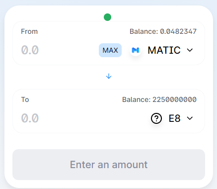

# How to Deposit Funds?

To deposit funds, **you should buy $E8 tokens** on Quickswap exchange by official contract address:\
`0x08e175a1eac9744a0f1ccaeb8f669af6a2bda3ce`

Then **open Energy8 application** and **select "Bridge"**:\
[`https://app.energy8.io/`](https://app.energy8.io/)

.png>)

After, **approve the transaction** and **click "Deposit"**.

**Done!** You deposited funds on the Energy8 Minecraft server, it's simple.
