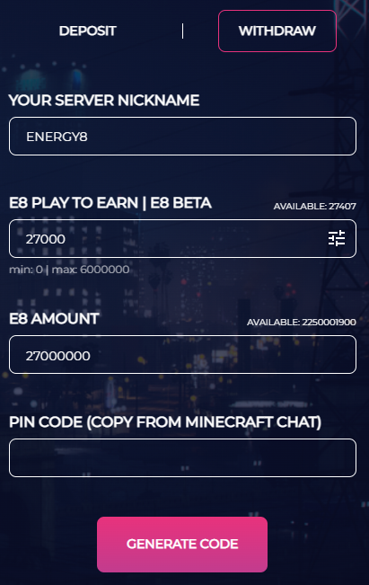

# How to Withdraw Funds?

To withdraw funds, you should **open Energy8 application** and **select "Bridge", Withdraw chapter**:\
[`https://app.energy8.io`](https://app.energy8.io/)

Then **click on "Generate Code"** and type **into Minecraft chat** to get the withdrawal code:\
`/mail read`

After, **type code** and **confirm transaction**.

**Cool!** You have withdrawn funds from the Energy8 Minecraft server, it's simple.
